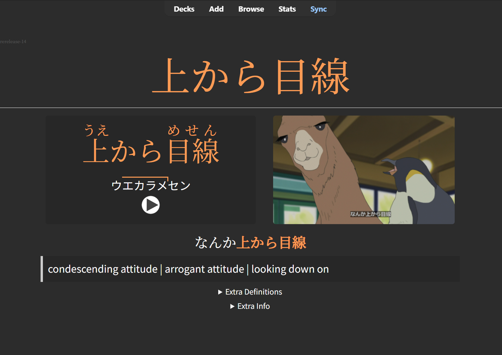

# Summary

Reference for materials and websites I've used on my Japanese learning Journey

## Textbooks

- Genki 1/2
- New Kaizen N4 Workbook - Grammar
- New Kaizen N4 Workbook - Reading 

## My Teachers
- [Yuka Sensei](https://www.italki.com/en/teacher/7112070)
- [Soso/Sekki Sensei](https://www.italki.com/en/teacher/8728257)

## Youtubers who teach Japanese well

- [Japanese Ammo with Misa](https://www.youtube.com/c/JapaneseAmmowithMisa) - Lots of videos on grammar points
- [Tokini Andy](https://www.youtube.com/@ToKiniAndy) - Andy has a grammar video over each chapter of Genki. I found these useful for reviewing the chapter after reading it or going over it with my Japanese sensei.
- [dougen](https://www.youtube.com/@Dogen) - Most learners know about dougen.  He is the foreign liguistics expert on understanding the most commonly spoken Tokyo dialect.  Watch him if you are looking to improve pronounciation.

## Apps

- [yomitan](https://chromewebstore.google.com/detail/yomitan/likgccmbimhjbgkjambclfkhldnlhbnn) A chrome extension that can give you the definition of highlighted text on you desktop.  This can also be used to create study cards from the highlighted word.
- [imiwa](https://apps.apple.com/us/app/imiwa/id288499125) A dictionary that parses out the content on your clipboard.  Very useful for getting the readings of Kanji without needing to manually search for them.  Only on iOS.
- [NHK Accent Dictionary](https://www.monokakido.jp/en/dictionaries/nhkaccent2/) Dictionary for looking up the NHK official Tokyo accent information on words.

## Reading 

### Kanji Review

[WaniKani](wanikani.com) - I do this every day since starting Japanese, it has helped alot with reading. 

I reccomend learning about SRS or Spaced Repitition Systems.  This is considered the best way to memorize/learn things backed by scientific studies and the like.  I reccomend reading about it more because it helps understand why it works and motivated me more to keep on studying this way.


### Honto eReader

Pros: Highlighting, cheap, can add comments

Cons: No direct copy/paste in the app, installing was a little weird

# Fun things that made in not feel like studying

- Playing a game and looking up words as you go, I have been playing Ni No Kuni.  Recently, I've been playing the PC version of Persona 3 and I feel it's around my reading level
- Anime/drama on netflix usually have Japanese subtitles
- Making friends to have conversation with.  This definitely helps with using the language every day!


# Useful Websites

[Satori Reader](https://satorireader.com/)
[Tofugu](https://www.tofugu.com/)
[JLPT Sensei](https://jlptsensei.com/)

## Sentence Mining

Recently, I've been using this [Lazy Guide to Sentence Mining](https://xelieu.github.io/jp-lazy-guide/) on my Windows 11 PC to do sentence mining and create Anki cards.  I've spent alot of time trying to come up with the "best" mining process and this took away the analysis paralysis that comes with making so many decisions.  I can just start mining right away.

The process is super easy and useful for learning words because the words will have context to things that you've actually experienced or watched instead of learning directly from a textbook.  Having a story to connect to the word makes memorizing it way easier.

<p align="center">
    
</p>

Once it's all set up, you can highlight a subtitle/text, click a button to add to Anki deck, screenshot the image, then record the text.  After only a couple seconds, you then have a full fledged anki card. 

#### Mining Video Games

I use the [OBS media player](https://obsproject.com/) to record my game sessions and then rewatch the video to make flash cards.  Generally, I recommend games that have subtitles so that it's easier to look up the kanji and sentences later.  

Games I've Mined:
  - [Persona 3](https://store.steampowered.com/app/2161700/Persona_3_Reload/)
  - [Ni no Kuni](https://store.steampowered.com/app/798460/Ni_no_Kuni_Wrath_of_the_White_Witch_Remastered/)

# Japan Experiences

- [2022 Trip to Japan](https://findpenguins.com/7snmo39mjfook/trip/isekai-travels-japan?sort=ASC)
- [2023 Trip to Japan](https://findpenguins.com/7snmo39mjfook/trip/654df9706d9564-72338503?sort=ASC)
- [着ぐるみ300匹で 緑黄色社会 "Mela!" を踊ってみた【YouTube完全版】#JMoF #JMoF2024](https://www.youtube.com/watch?v=Nvl4AHIP5l4&lc=Ugwg5MwEKOj7_NWGrLZ4AaABAg)
```
parts where I show up:

3:08-3:24; My main dance part
4:05; for like 1 second
4:25; Group dance
6:39, 6:48; challenge dance
9:58-10:30; BTS dance
12:00-12:06, 12:12-12:15; 'Challenge' dance
13:03 credits photo
```
